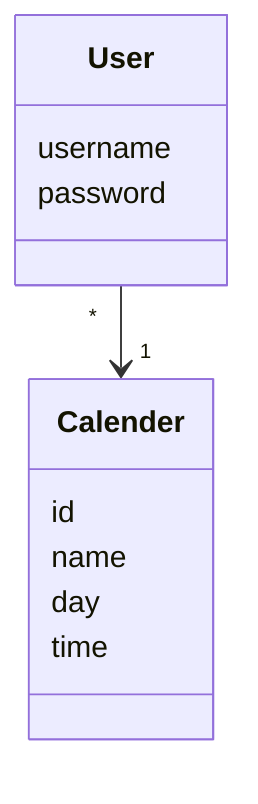

# Arkkitehtuurikuvaus

## Rakenne

Ohjelman rakenne noudattaa kolmitasoista kerrosarkkitehtuuria, ja koodin pakkausrakenne on seuraavan UML-kaavion mukainen:

Pakkaus **ui** sisältää käyttöliittymästä, **services** sovelluslogiikasta ja **repositories** tietojen pysyväistallennuksesta vastaavan koodin. Pakkauksen **entities** sisällä on luokkia, jotka edustavat sovelluksen käsittelemiä tietokohteita.

## Sovelluslogiikka

Sovelluksen loogisen tietomallin muodostavat luokat [User](https://github.com/levomaaa/ot-harjoitustyo/blob/main/src/entities/user.py) ja [Calender] (tulossa), jotka kuvaavat käyttäjiä ja ajanvarauskalenteria:

Sovelluslogiikka saattaa hiukan muuttua kurssin edetessä, mutta runko tulee olemaan samanlainen.

Toiminnallisista kokonaisuuksista vastaa luokan [Service](https://github.com/levomaaa/ot-harjoitustyo/blob/main/src/services/service.py) ainoa Service-olio. Jokaiselle käyttöliittymän toiminnolle on määritelty omat metodinsa Service-luokassa.

## Päätoiminnallisuudet

Sovelluksen toimintalogiikka sekvenssikaaviona muutaman päätoiminnallisuuden osalta.

### Käyttäjän kirjautuminen

Kun kirjautumisnäkymän syötekenttiin annetaan käyttäjätunnus ja salasana, jonka jälkeen painetaan Login-painiketta, etenee sovelluksen toiminta seuraavasti:

Login-painikkeen painamiseen reagoiva [tapahtumankäsittelijä](https://github.com/levomaaa/ot-harjoitustyo/blob/main/src/ui/login_view.py#L38) kutsuu sovelluslogiikan `Service` metodia [login](https://github.com/levomaaa/ot-harjoitustyo/blob/main/src/services/service.py#L70) antaen tälle parametreinä käyttäjätunnuksen ja salasanan. Sovelluslogiikka tarkistaa `UserRepository`:n avulla onko käyttäjätunnus jo olemassa. Jos näin on, niin tarkastetaan, täsmääkö salasanat. Jos salasanat täsmäävät, kirjautuminen onnistuu. Tämän jälkeen käyttöliittymä vaihtaa näkymäksi `CalenderView`:n eli näytölle aukeaa ajanvarauskalenteri varauksineen.