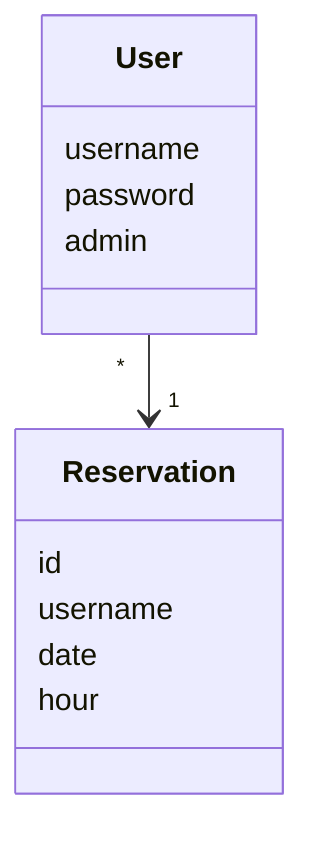
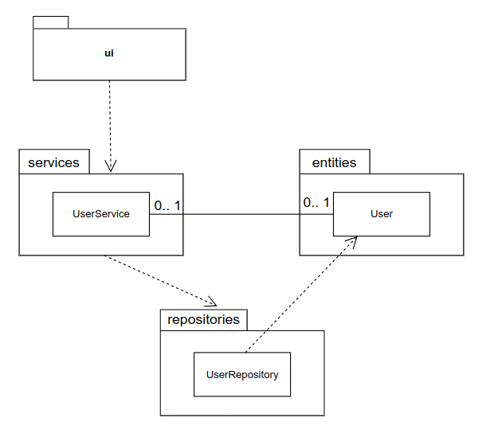
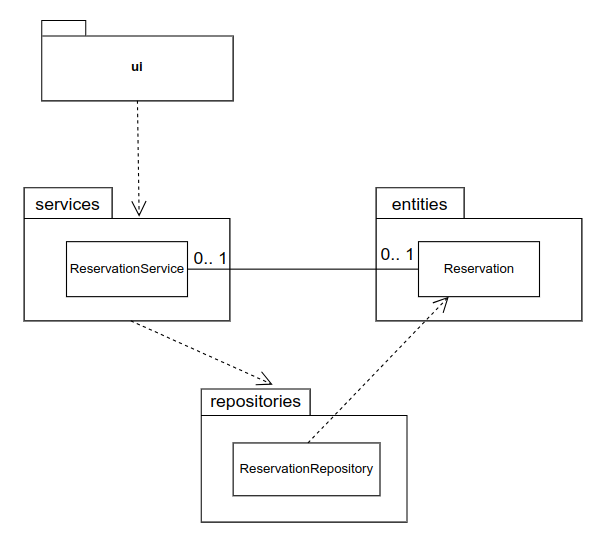
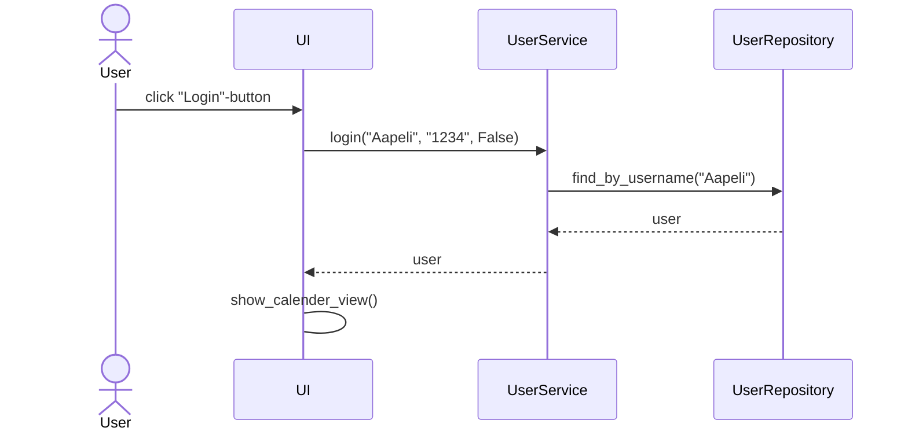
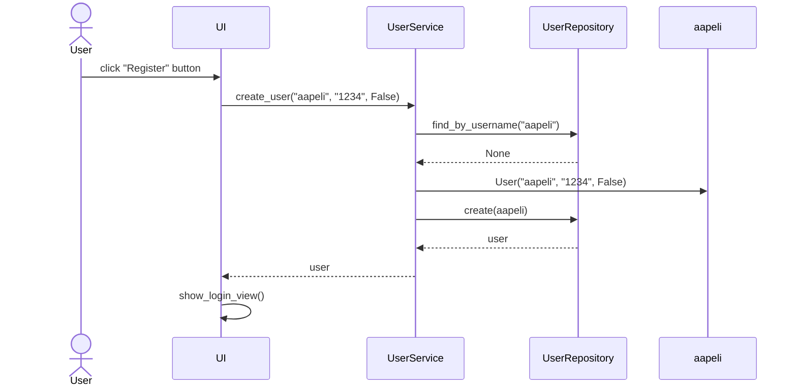
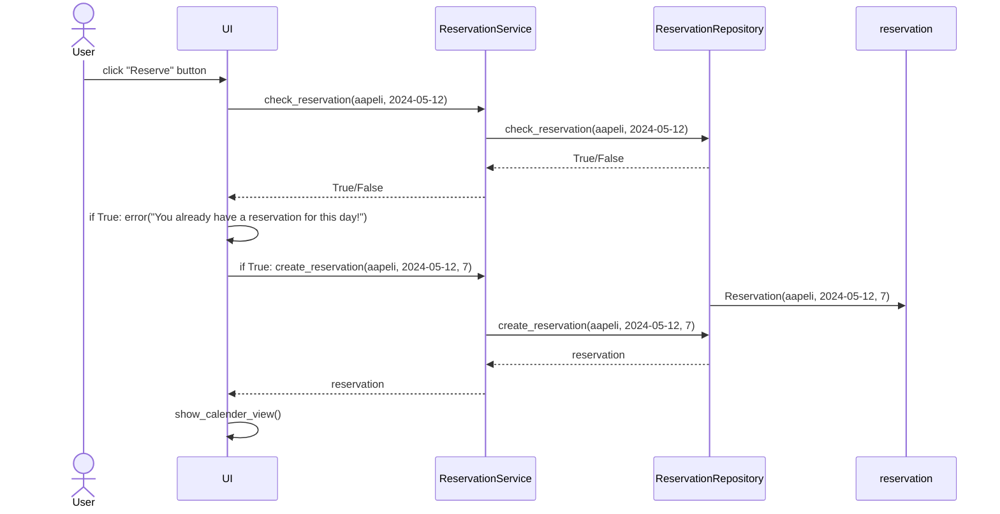

# Arkkitehtuurikuvaus

## Rakenne

Ohjelman rakenne noudattaa kolmitasoista kerrosarkkitehtuuria, ja koodin pakkausrakenne on seuraavan UML-kaavion mukainen:

Pakkaus **ui** sisältää käyttöliittymästä, **services** sovelluslogiikasta ja **repositories** tietojen pysyväistallennuksesta vastaavan koodin. Pakkauksen **entities** sisällä on luokkia, jotka edustavat sovelluksen käsittelemiä tietokohteita.

## Käyttöliittymä

Käyttöliittymä sisältää neljä erillistä näkymää:

- Kirjautuminen
- Uuden käyttäjän luominen
- Kalenteri
  - Päiväkohtainen ajanvarausnäkymä

Kirjautuminen, uuden käyttäjän luominen ja kalenteri ovat toteutettu omina luokkinaan. Päiväkohtainen ajanvarausnäkymä sisältyy kalenteri-luokkaan. Näkymien näyttämisestä vastaa luokka [UI](https://github.com/levomaaa/ot-harjoitustyo/blob/main/src/ui). Käyttöliittymä kutsuu vain [UserService](https://github.com/levomaaa/ot-harjoitustyo/blob/main/src/services/user_service.py) sekä [ReservationService](https://github.com/levomaaa/ot-harjoitustyo/blob/main/src/services/reservation_service.py) -luokkien metodeja, ja se on myös pyritty eristämään täysin sovelluslogiikasta.

Kun sovelluksen ajanvaraus-tilanne muuttuu, eli uusi käyttäjä kirjautuu, luodaan uusi admin, käyttäjä tekee varauksen tai peruuttaa varauksen, kutsutaan sovelluksen metodia [__init__](https://github.com/levomaaa/ot-harjoitustyo/blob/main/src/ui/calender_view.py#L12), joka renderöi kalenterinäkymän uudestaan vastaamaan tämän hetkistä tilannetta sovelluslogiikalta saamojensa tietojen perusteella.

## Sovelluslogiikka

Sovelluksen loogisen tietomallin muodostavat luokat [User](https://github.com/levomaaa/ot-harjoitustyo/blob/main/src/entities/user.py) ja [Reservation](https://github.com/levomaaa/ot-harjoitustyo/blob/main/src/entities/reservation.py), jotka kuvaavat käyttäjiä ja ajanvarauskalenterin ajanvarauksia:

Käyttäjien toiminnallisista kokonaisuuksista vastaa luokan [UserService](https://github.com/levomaaa/ot-harjoitustyo/blob/main/src/services/user_service.py) UserService-olio. Ajanvarauksien toiminnallisista kokonaisuuksista taas vastaa luokan [ReservationService](https://github.com/levomaaa/ot-harjoitustyo/blob/main/src/services/reservation_service.py) RepositoryService-olio. Jokaiselle käyttöliittymän käyttäjään liittyville toiminnoille on määritelty omat metodinsa UserService-luokassa ja ajanvarauksille taas RepositoryService-luokassa.

`UserService` pääsee käsiksi käyttäjiin, käyttäjätietojen tallennuksesta vastaavan [UserRepository](https://github.com/levomaaa/ot-harjoitustyo/blob/main/src/repositories/user_repository.py) luokan kautta. Vastaavasti `ReservationService` pääsee käsiksi ajanvarauksiin, ajanvarauksien tallennuksesta vastaavan [ReservationRepository](https://github.com/levomaaa/ot-harjoitustyo/blob/main/src/repositories/reservation_repository.py) luokan kautta.

`UserService`-luokan ja ohjelman käyttäjiä koskevien osien suhdetta kuvaava luokka/pakkauskaavio:

`ReservationService`-luokan ja ohjelman ajanvarauksia koskevien osien suhdetta kuvaava luokka/pakkauskaavio:

## Tietojen pysyväistallennus

Pakkauksen _repositories_ luokat `UserRepository` ja `ReservationRepository` huolehtivat tietojen tallentamisesta. Molemmat luokista tallentavat tietoa SQLite-tietokantaan.

Molemmat luokat noudattavat [Repository](https://en.wikipedia.org/wiki/Data_access_object) -suunnittelumallia ja ne ovat tarvittaessa mahdollista korvata toisenlaisilla toteutustavoilla, jos sovelluksen datan talletustapaa halutaan vaihtaa. Sovelluslogiikan testauksessa käytetäänkin menetelmää, jossa testit käyttävät keskusmuistiin tallentavia ratkaisuja sen sijaan, että ne hyödyntäisivät tietokantaan tallentavia objekteja.

### Tiedostot

Sovellus tallentaa käyttäjien ja ajanvarauksien tiedot [database.sqlite](https://github.com/levomaaa/ot-harjoitustyo/blob/main/data/database.sqlite)-tietokantatiedostoon. 

Käyttäjät tallennetaan tiedostossa olevaan SQLite-tietokannan tauluun `users` ja ajanvaraukset SQLite-tietokannan tauluun `reservations`. Nämä tietokantataulut ovat alustettu [initialize_database.py](https://github.com/levomaaa/ot-harjoitustyo/blob/main/src/initialize_database.py)-tiedostossa.

## Päätoiminnallisuudet

Sovelluksen toimintalogiikka sekvenssikaaviona muutaman päätoiminnallisuuden osalta.

### Käyttäjän kirjautuminen

Kun kirjautumisnäkymän syötekenttiin annetaan käyttäjätunnus ja salasana, jonka jälkeen painetaan Login-painiketta, etenee sovelluksen toiminta seuraavasti:

Login-painikkeen painamiseen reagoiva [tapahtumankäsittelijä](https://github.com/levomaaa/ot-harjoitustyo/blob/main/src/ui/login_view.py#L42) kutsuu sovelluslogiikan `UserService` metodia [login](https://github.com/levomaaa/ot-harjoitustyo/blob/main/src/services/user_service.py#L66) antaen tälle parametreinä käyttäjätunnuksen ja salasanan. Sovelluslogiikka tarkistaa `UserRepository`:n avulla onko käyttäjätunnus jo olemassa. Jos näin on, niin tarkastetaan, täsmääkö salasanat. Jos salasanat täsmäävät, kirjautuminen onnistuu. Tämän jälkeen käyttöliittymä vaihtaa näkymäksi `CalenderView`:n eli näytölle aukeaa ajanvarauskalenteri varauksineen.

### Uuden käyttäjän luominen

Kun käyttäjän luomisnäkymän syötekenttiin annetaan käyttäjätunnus ja salasana kahdesti, jonka jälkeen painetaan Register-painiketta, etenee sovelluksen toiminta seuraavasti:

Register-painikkeen painamiseen reagoiva [tapahtumankäsittelijä](https://github.com/levomaaa/ot-harjoitustyo/blob/main/src/ui/create_user_view.py#L42) kutsuu sovelluslogiikan `UserService` metodia [create_user](https://github.com/levomaaa/ot-harjoitustyo/blob/main/src/services/user_service.py#L42) antaen tälle parametreinä käyttäjätunnuksen ja salasanan. Sovelluslogiikka tarkistaa `UserRepository`:n avulla onko käyttäjätunnus jo olemassa, onko käyttäjätunnus tai salasana liian lyhyt tai sisältää pelkkiä välilyöntejä, onko salasana kirjoitettu kaksi kertaa oikein. Jos yksikin näistä epäonnistuu, tulee näytölle virheilmoitus, joka kertoo, mikä yllä mainituista asioista meni pieleen. Onnistuneen käyttäjän luonnin jälkeen käyttöliittymä vaihtaa näkymäksi `LoginView`:n, jossa käyttäjä voi nyt kirjautua sisään luomillaan tunnuksilla.

### Ajanvarauksen tekeminen

Ajanvarauksen tekevän "Reserve"-painikkeen klikkaamisen jälkeen sovelluksen toiminta etenee seuraavasti:

Reserve-painikkeen painamiseen reagoiva [tapahtumankäsittelijä](https://github.com/levomaaa/ot-harjoitustyo/blob/main/src/ui/calender_view.py#L56) kutsuu ensin sovelluslogiikan `ReservationService` metodia [check_reservation](https://github.com/levomaaa/ot-harjoitustyo/blob/main/src/services/reservation_service.py#L52), joka tarkistaa `ReservationRepository`:n avulla, onko käyttäjä jo tehnyt varauksen kyseiselle päivälle. Jos näin on se palauttaa True, ja käyttäjä saa virheilmoituksen. Jos se palauttaa False, niin tapahtumankäsittelijä kutsuu sovelluslogiikan `ReservationService` metodia [create_reservation](https://github.com/levomaaa/ot-harjoitustyo/blob/main/src/services/reservation_service.py#L25), joka luo ajanvarauksen `ReservationRepository`:n avulla. Onnistuneen ajanvarauksen myötä siirrytään näkymään `CalenderView` ja ajanvaraus näkyy, kun avataan kyseisen päivän ajanvarauskalenteri.

### Muut toiminnallisuudet

Muut sovelluksen toiminnot seuraavat samaa periaatetta. Jokaisessa toiminnallisuudessa käyttöliittymän tapahtumakäsittelijä kutsuu sovelluslogiikan sopivaa metodia, joka päivittää ajanvarausten tai kirjautuneen käyttäjän tilan. Kun hallinta palaa käyttöliittymään, tarvittaessa päivitetään ajanvarauslistaa ja näkyvää tilaa.

## Ohjelman rakenteeseen jääneet heikkoudet

### Käyttöliittymä

Käyttöliittymän ryhmittelyä voisi parantaa. Etenkin yksittäisen päivän ajanvarauskalenterin olisi voinut tehdä omalle tiedostolle, kun tällä hetkellä se on luokan [calender_view.py](https://github.com/levomaaa/ot-harjoitustyo/blob/main/src/ui/calender_view.py) seassa.