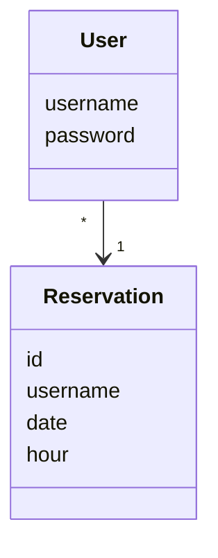
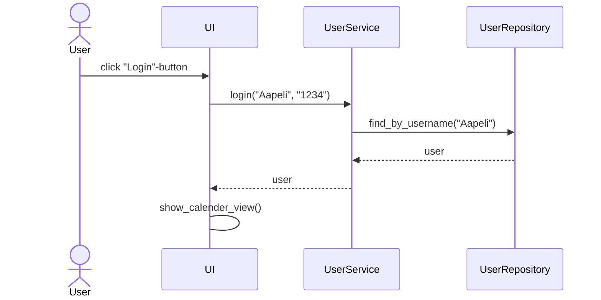
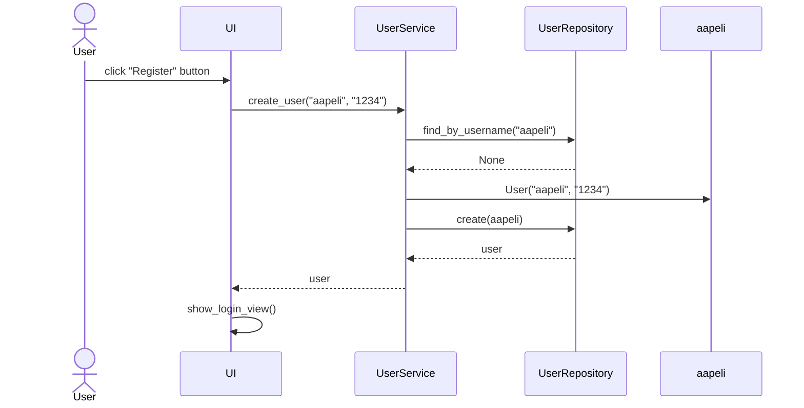

# Arkkitehtuurikuvaus

## Rakenne

Ohjelman rakenne noudattaa kolmitasoista kerrosarkkitehtuuria, ja koodin pakkausrakenne on seuraavan UML-kaavion mukainen:

Pakkaus **ui** sisältää käyttöliittymästä, **services** sovelluslogiikasta ja **repositories** tietojen pysyväistallennuksesta vastaavan koodin. Pakkauksen **entities** sisällä on luokkia, jotka edustavat sovelluksen käsittelemiä tietokohteita.

## Sovelluslogiikka

Sovelluksen loogisen tietomallin muodostavat luokat [User](https://github.com/levomaaa/ot-harjoitustyo/blob/main/src/entities/user.py) ja [Reservation](https://github.com/levomaaa/ot-harjoitustyo/blob/main/src/entities/reservation.py), jotka kuvaavat käyttäjiä ja ajanvarauskalenterin ajanvarauksia:

Käyttäjien toiminnallisista kokonaisuuksista vastaa luokan [UserService](https://github.com/levomaaa/ot-harjoitustyo/blob/main/src/services/user_service.py) UserService-olio. Ajanvarauksien toiminnallisista kokonaisuuksista taas vastaa luokan [RepositoryService](https://github.com/levomaaa/ot-harjoitustyo/blob/main/src/services/repository_service.py) RepositoryService-olio. Jokaiselle käyttöliittymän käyttäjään liittyville toiminnoille on määritelty omat metodinsa UserService-luokassa ja ajanvarauksille taas RepositoryService-luokassa.

`UserService` pääsee käsiksi käyttäjiin, käyttäjätietojen tallennuksesta vastaavan [UserRepository](https://github.com/levomaaa/ot-harjoitustyo/blob/main/src/repositories/user_repository.py) luokan kautta. Vastaavasti `ReservationService` pääsee käsiksi ajanvarauksiin, ajanvarauksien tallennuksesta vastaavan [ReservationRepository](https://github.com/levomaaa/ot-harjoitustyo/blob/main/src/repositories/reservation_repository.py) luokan kautta.

`UserService`-luokan ja ohjelman käyttäjiä koskevien osien suhdetta kuvaava luokka/pakkauskaavio:

`ReservationService`-luokan ja ohjelman ajanvarauksia koskevien osien suhdetta kuvaava luokka/pakkauskaavio:

## Päätoiminnallisuudet

Sovelluksen toimintalogiikka sekvenssikaaviona muutaman päätoiminnallisuuden osalta.

### Käyttäjän kirjautuminen

Kun kirjautumisnäkymän syötekenttiin annetaan käyttäjätunnus ja salasana, jonka jälkeen painetaan Login-painiketta, etenee sovelluksen toiminta seuraavasti:

Login-painikkeen painamiseen reagoiva [tapahtumankäsittelijä](https://github.com/levomaaa/ot-harjoitustyo/blob/main/src/ui/login_view.py#L38) kutsuu sovelluslogiikan `UserService` metodia [login](https://github.com/levomaaa/ot-harjoitustyo/blob/main/src/services/user_service.py#L70) antaen tälle parametreinä käyttäjätunnuksen ja salasanan. Sovelluslogiikka tarkistaa `UserRepository`:n avulla onko käyttäjätunnus jo olemassa. Jos näin on, niin tarkastetaan, täsmääkö salasanat. Jos salasanat täsmäävät, kirjautuminen onnistuu. Tämän jälkeen käyttöliittymä vaihtaa näkymäksi `CalenderView`:n eli näytölle aukeaa ajanvarauskalenteri varauksineen.

### Uuden käyttäjän luominen

Kun käyttäjän luomisnäkymän syötekenttiin annetaan käyttäjätunnus ja salasana kahdesti, jonka jälkeen painetaan Register-painiketta, etenee sovelluksen toiminta seuraavasti:

Register-painikkeen painamiseen reagoiva [tapahtumankäsittelijä](https://github.com/levomaaa/ot-harjoitustyo/blob/main/src/ui/create_user_view.py#L36) kutsuu sovelluslogiikan `UserService` metodia [create_user](https://github.com/levomaaa/ot-harjoitustyo/blob/main/src/services/user_service.py#L41) antaen tälle parametreinä käyttäjätunnuksen ja salasanan. Sovelluslogiikka tarkistaa `UserRepository`:n avulla onko käyttäjätunnus jo olemassa, onko käyttäjätunnus tai salasana liian lyhyt tai sisältää pelkkiä välilyöntejä, onko salasana kirjoitettu kaksi kertaa oikein. Jos yksikin näistä epäonnistuu, tulee näytölle virheilmoitus, joka kertoo, mikä yllä mainituista asioista meni pieleen. Onnistuneen käyttäjän luonnin jälkeen käyttöliittymä vaihtaa näkymäksi `LoginView`:n, jossa käyttäjä voi nyt kirjautua sisään luomillaan tunnuksilla.