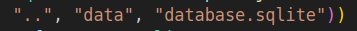
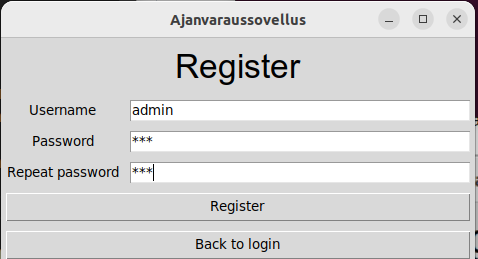
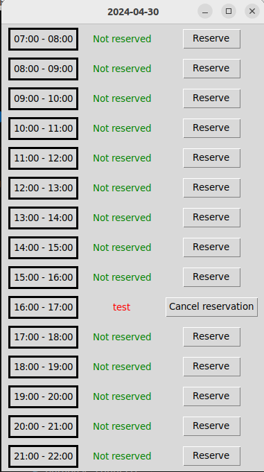
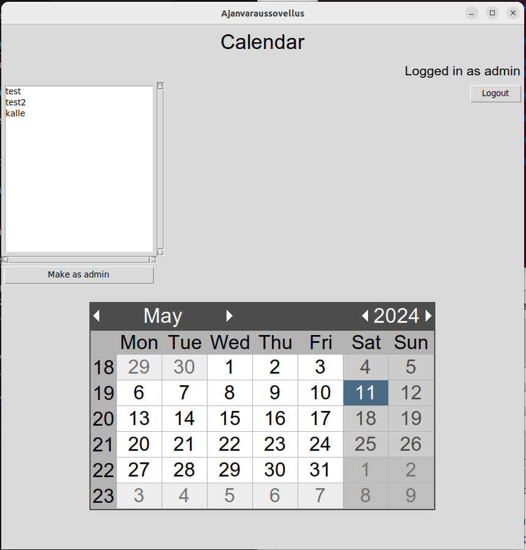

# Käyttöohje

Lataa projektin edellisen [releasen](https://github.com/levomaaa/ot-harjoitustyo/releases) lähdekoodi valitsemalla _Assets_-osion alta _Source code_.

## Konfigurointi

Tallennukseen käytettävän tiedoston nimeä voi halutessaan konfiguroida syöttämällä  _database_connection.py_-tiedostossa oleviin seuraaviin kenttiin haluamansa tiedostonimet ja luomalla nimiä vastaavat kansiot ja tiedostot: . Tiedosto luodaan automaattisesti _data_-hakemistoon, jos sitä ei siellä vielä ole. Tiedoston muoto on seuraava:

```
database.sqlite
```

## Ohjelman käynnistäminen

Ennen ohjelman käynnistämistä:

1. Asenna riippuvuudet komennolla:

```bash
poetry install
```

2. Suorita vaadittavat tietokannan alustustoimenpiteet komennolla:

```bash
poetry run invoke build
```

3. Käynnistä sovellus komennolla:

```bash
poetry run invoke start
```

## Kirjautuminen

Sovellus käynnistyy kirjautumisnäkymään:


Kirjautuminen onnistuu syöttämällä olemassaoleva käyttäjätunnus ja salasana syöttökenttiin, sekä paimalla "Login"-painiketta.

## Uuden käyttäjän luominen

Kirjautumisnäkymästä voidaan siirtyä uuden käyttäjän luomisnäkymään painamalla painiketta "Create a new user".

Uusi käyttäjä luodaan syöttämällä käyttäjätunnus ja kahdesti salasana syötekenttiin, sekä painamalla "Register"-painiketta:


Jos käyttäjän luominen onnistuu, siirrytään takaisin kirjautumisnäkymään, josta voidaan kirjautua sisään luomallamme käyttäjällä. Jos käyttäjän luominen epäonnistuu, saat virheilmoituksen, joka kertoo mikä on pielessä.

## Ensimmäisen adminin luominen

Ensimmäsen adminin luominen tapahtuu kuten uuden käyttäjän luominen. Ensimmäinen admin luodaan syöttämällä käyttäjän nimeksi "admin" ja syöttämällä sille kahdesti haluamasi salasana:



Lopuksi painamalla "Register"-painiketta admin luodaan ja sillä voidaan kirjautua sisään.

## Ajan varaaminen

Onnistuneen kirjautumisen myötä siirrytään kalenterinäkymään:


Oikeassa yläkulmassa olevasta "Logout"-painikkeesta voimme kirjautua ulos, ja tämän yläpuolella näemmä sisäänkirjautuneen käyttäjän nimen.

Voimme siirtyä varaamaan tunnin mittaisen ajan klikkaamalla kalenterista haluamaamme päivää. Klikkaamalla päivää aukeaa päivän ajanvarauskalenteri:


Ajanvarauskalenterista voimme varata ajan painamalla "Reserve"-painiketta. Tällöin ohjelma antaa ilmoituksen varauksen toteutumisesta ja siirtää käyttäjän takaisin kalenterinäkymään. Jos sinulla on jo voimassa varaus kyseiselle päivälle, ohjelma antaa virheilmoituksen, koska saat tehdä vain yhden varauksen per päivä. 

## Ajanvarauksen peruuttaminen

Onnistuneen ajanvarauksen myötä näet ajanvarauksesi kyseisen päivän ja ajan kohdalla avaamalla kyseisen päivän ajanvarauskalenterin:



Voit peruuttaa sen painamalla "Cancel reservation"-painiketta, jolloin ohjelma antaa ilmoituksen ajanvarauksen peruuttamisen toteutumisesta ja siirtää käyttäjän takaisin kalenterinäkymään.

HUOM! Voit peruuttaa vain itse tekemiäsi ajanvarauksia paitsi, jos sinulla on admin-rooli, voit peruuttaa kenen tahansa tekemiä varauksia.

## Adminien lisääminen

Voit tehdä toisesta käyttäjästä adminin, jos sinulla itsellä on admin-rooli. Adminit näkevät listan kaikista käyttäjistä, jotka eivät ole admineita, kalenterinäkymässä oikeassa yläkulmassa:



Valitsemalla listasta haluamasi käyttäjän ja painamalla "Make as admin"-painiketta saat varmistusviestin, jossa kysytään haluatko varmasti tehdä kyseisestä käyttäjästä adminin. Jos vastaat tähän kyllä, niin kyseiselle käyttäjälle annetaan admin-rooli ja se poistetaan listasta.
