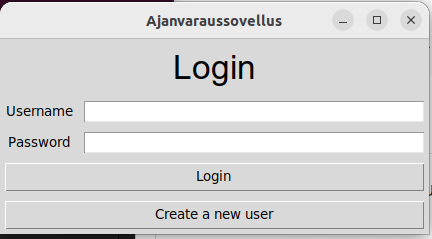
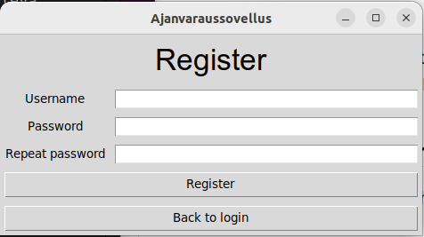
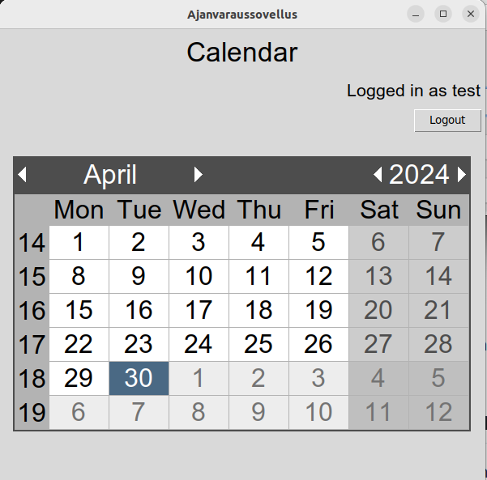
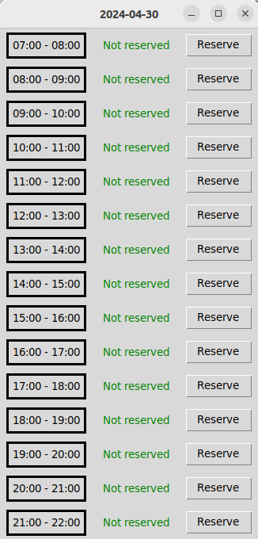

# Käyttöohje

Lataa projektin edellisen [releasen](https://github.com/levomaaa/ot-harjoitustyo/releases) lähdekoodi valitsemalla _Assets_-osion alta _Source code_.

## Ohjelman käynnistäminen

Ennen ohjelman käynnistämistä:

1. Asenna riippuvuudet komennolla:

```bash
poetry install
```

2. Suorita vaadittavat tietokannan alustustoimenpiteet komennolla:

```bash
poetry run invoke build
```

3. Käynnistä sovellus komennolla:

```bash
poetry run invoke start
```

## Kirjautuminen

Sovellus käynnistyy kirjautumisnäkymään:



Kirjautuminen onnistuu syöttämällä olemassaoleva käyttäjätunnus ja salasana syöttökenttiin, sekä paimalla "Login"-painiketta.

## Uuden käyttäjän luominen

Kirjautumisnäkymästä voidaan siirtyä uuden käyttäjän luomisnäkymään painamalla painiketta "Create a new user".

Uusi käyttäjä luodaan syöttämällä käyttäjätunnus ja kahdesti salasana syötekenttiin, sekä painamalla "Register"-painiketta:



Jos käyttäjän luominen onnistuu, siirrytään takaisin kirjautumisnäkymään, josta voidaan kirjautua sisään luomallamme käyttäjällä.

## Ajan varaaminen

Onnistuneen kirjautumisen myötä siirrytään kalenterinäkymään:



Oikeassa yläkulmassa olevasta "Logout"-painikkeesta voimme kirjautua ulos, ja tämän yläpuolella näemmä sisäänkirjautuneen käyttäjän nimen.

Voimme siirtyä varaamaan mittaisen ajan klikkaamalla kalenterista haluamaamme päivää. Klikkaamalla päivää aukeaa päivän ajanvarauskalenteri:



Ajanvarauskalenterista voimme varata ajan painamalla "Reserve"-painiketta. Tällöin ohjelma antaa ilmoituksen varauksen toteutumisesta ja siirtää käyttäjän takaisin kalenterinäkymään. 