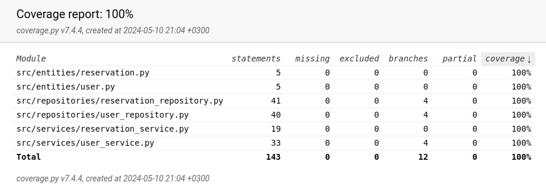

# Testausdokumentti

Ohjelmaa on testattu sekä automatisoiduin yksikkö- ja integraatiotestein unittestilla sekä manuaalisesti järjestelmätason testien muodossa.

## Yksikkö- ja integraatiotestaus

### Sovelluslogiikka

Sovelluslogiikasta vastaavia luokkia `UserService` ja `ReservationService` testataan testiluokilla [TestUserService](https://github.com/levomaaa/ot-harjoitustyo/blob/main/src/tests/services/user_service_test.py) sekä [TestReservationService](https://github.com/levomaaa/ot-harjoitustyo/blob/main/src/tests/services/reservation_service_test.py). `UserService` sekä `ReservationService` -oliot alustetaan, niin että niille injektoidaan riippuvuksiksi repositorio-oliot, jotka tallentavat tietoa muistiin pysyväistallennuksen sijaan. Tästä syystä testeissä on käytössä luokat `FakeUserRepository` ja `FakeReservationRepository`.

### Repositorio-luokat

Repositorio-luokkia `UserRepository` ja `ReservationRepository` testataan vain testeissä käytössäolevilla tiedostoilla. `UserRepository`-luokkaa testataan [TestUserRepository](https://github.com/levomaaa/ot-harjoitustyo/blob/main/src/tests/repositories/user_repository_test.py)-testiluokalla ja `ReservationRepository`-luokkaa [TestReservationRepository](https://github.com/levomaaa/ot-harjoitustyo/blob/main/src/tests/repositories/reservation_repository_test.py)-testiluokalla.

### Testauskattavuus

Sovelluksen testauksen haarautumakattavuus on 100%:

Käyttöliittymäkerros sekä tietokannan luomisesta vastaavat tiedostot jäivät testaamisen ulkopuolella tarkoituksella. Kaikki olennainen ohjelmasta on siis testattu.

## Järjestelmätestaus

Sovelluksen toiminnallisuutta on testattu manuaalisesti kattavasti käyttäen erilaisia skenaarioita ja syötteitä.

### Asennus ja konfigurointi

Sovellus on haettu ja sitä on testattu [käyttöohjeen](./kayttoohje.md) kuvaamalla tavalla Linux-ympäristössä.

Sovellusta on testattu tilanteessa, jossa sovellus ladataan suoraan githubin releasena ja tällöin tietokantatiedostot tulevat valmiiksi data-kansion mukana.

### Toiminnallisuudet

Kaikki [määrittelydokumentin](./vaatimusmaarittely.md#perusversion-tarjoama-toiminnallisuus) ja käyttöohjeen listaamat toiminnallisuudet on testattu manuaalisesti, ja virheellisestä toiminnasta tulee aina asianmukainen virheilmoitus. Kaikkien toiminnallisuuksien yhteydessä on syötekenttiin yritetty syöttää virheellisiä arvoja kuten tyhjiä, liian lyhyitä ja vain välilyöntejä sisältäviä.

