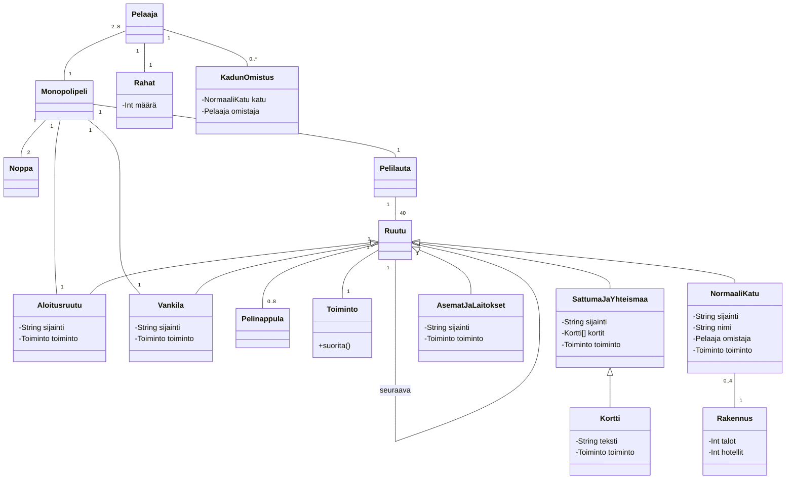

```mermaid
 classDiagram
    Monopolipeli "1" -- "2" Noppa
    Monopolipeli "1" -- "1" Pelilauta
    Monopolipeli "1" -- "1" Aloitusruutu
    Monopolipeli "1" -- "1" Vankila
    Pelilauta "1" -- "40" Ruutu
    Ruutu "1" -- "1" Ruutu : seuraava
    Ruutu "1" -- "0..8" Pelinappula
    Ruutu "1" -- "1" Toiminto
    Ruutu <|-- Aloitusruutu
    Ruutu <|-- Vankila
    Ruutu <|-- SattumaJaYhteismaa
    Ruutu <|-- AsematJaLaitokset
    Ruutu <|-- NormaaliKatu 
    SattumaJaYhteismaa <|-- Kortti
    NormaaliKatu "0..4" -- "1" Rakennus
    Pelaaja "2..8" -- "1" Monopolipeli
    Pelaaja "1" -- "1" Rahat
    Pelaaja "1" -- "0..*" KadunOmistus
   

class Aloitusruutu {
    -String sijainti
    -Toiminto toiminto
}

class Vankila {
    -String sijainti
    -Toiminto toiminto
}

class SattumaJaYhteismaa {
    -String sijainti
    -Kortti[] kortit
    -Toiminto toiminto
}

class AsematJaLaitokset {
    -String sijainti
    -Toiminto toiminto
}

class NormaaliKatu {
    -String sijainti
    -String nimi
    -Pelaaja omistaja
    -Toiminto toiminto
}

class Kortti {
    -String teksti
    -Toiminto toiminto
}

class Rakennus {
    -Int talot
    -Int hotellit
}

class Toiminto {
    +suorita()
}

class KadunOmistus {
    -NormaaliKatu katu
    -Pelaaja omistaja
}

class Rahat {
    -Int määrä
}
```