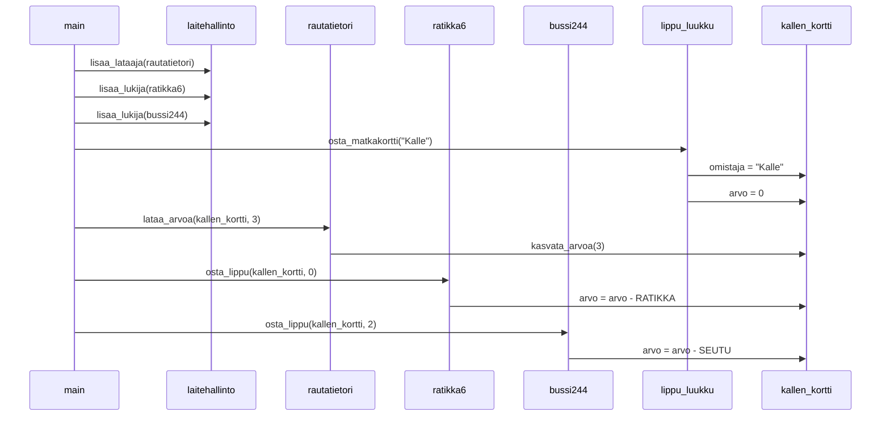

```mermaid
 sequenceDiagram
    participant main
    participant laitehallinto
    participant rautatietori
    participant ratikka6
    participant bussi244
    participant lippu_luukku
    participant kallen_kortti

    main ->> laitehallinto: lisaa_lataaja(rautatietori)
    main ->> laitehallinto: lisaa_lukija(ratikka6)
    main ->> laitehallinto: lisaa_lukija(bussi244)
    main ->> lippu_luukku: osta_matkakortti("Kalle")
    lippu_luukku ->> kallen_kortti: omistaja = "Kalle"
    lippu_luukku ->> kallen_kortti: arvo = 0
    main ->> rautatietori: lataa_arvoa(kallen_kortti, 3)
    rautatietori ->> kallen_kortti: kasvata_arvoa(3)
    main ->> ratikka6: osta_lippu(kallen_kortti, 0)
    ratikka6 ->> kallen_kortti: arvo = arvo - RATIKKA
    main ->> bussi244: osta_lippu(kallen_kortti, 2)
    bussi244 ->> kallen_kortti: arvo = arvo - SEUTU
```